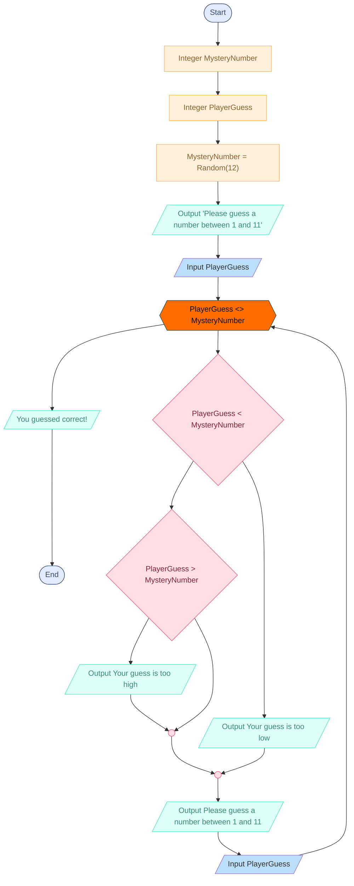

## Guessing Game Flowchart

```mermaid
flowchart TD
    A(["Start"]) --> n1["Integer MysteryNumber"]
    n1 --> n2["Integer PlayerGuess"]
    n2 --> n3["MysteryNumber = Random(12)"]
    n3 --> n4@{ label: "Output 'Please guess a number between 1 and 11'" }
    n4 --> n5["Input PlayerGuess"]
    n5 --> n6["PlayerGuess &lt;&gt; MysteryNumber"]
    n6 --> n7["You guessed correct!"] & n9["PlayerGuess &lt; MysteryNumber"]
    n7 --> n8(["End"])
    n9 --> n11["PlayerGuess > MysteryNumber"] & n12["Output Your guess is too low"]
    n11 --> n13["Output Your guess is too high"]
    n13 --> n14["Untitled Node"]
    n14 --> n15["Untitled Node"]
    n12 --> n15
    n15 --> n16["Output Please guess a number between 1 and 11"]
    n16 --> n17["Input PlayerGuess"]
    n17 --> n6
    n11 --> n14

    n4@{ shape: lean-r}
    n5@{ shape: lean-r}
    n6@{ shape: hex}
    n7@{ shape: lean-r}
    n9@{ shape: diam}
    n11@{ shape: diam}
    n12@{ shape: lean-r}
    n13@{ shape: lean-r}
    n14@{ shape: f-circ}
    n15@{ shape: f-circ}
    n16@{ shape: lean-r}
    n17@{ shape: lean-r}
     A:::Aqua
     A:::Sky
     n1:::Peach
     n2:::Peach
     n3:::Peach
     n4:::Aqua
     n5:::Class_03
     n6:::Pine
     n6:::Class_05
     n7:::Aqua
     n9:::Rose
     n8:::Sky
     n11:::Rose
     n12:::Aqua
     n13:::Aqua
     n14:::Rose
     n15:::Rose
     n16:::Aqua
     n17:::Class_03
    classDef Sky stroke-width:1px, stroke-dasharray:none, stroke:#374D7C, fill:#E2EBFF, color:#374D7C
    classDef Peach stroke-width:1px, stroke-dasharray:none, stroke:#FBB35A, fill:#FFEFDB, color:#8F632D
    classDef Aqua stroke-width:1px, stroke-dasharray:none, stroke:#46EDC8, fill:#DEFFF8, color:#378E7A
    classDef Rose stroke-width:1px, stroke-dasharray:none, stroke:#FF5978, fill:#FFDFE5, color:#8E2236
    classDef Class_03 fill:#BBDEFB
    classDef Pine stroke-width:1px, stroke-dasharray:none, stroke:#254336, fill:#27654A, color:#FFFFFF
    classDef Class_05 fill:#FF6D00
    style n6 color:#000000

```
